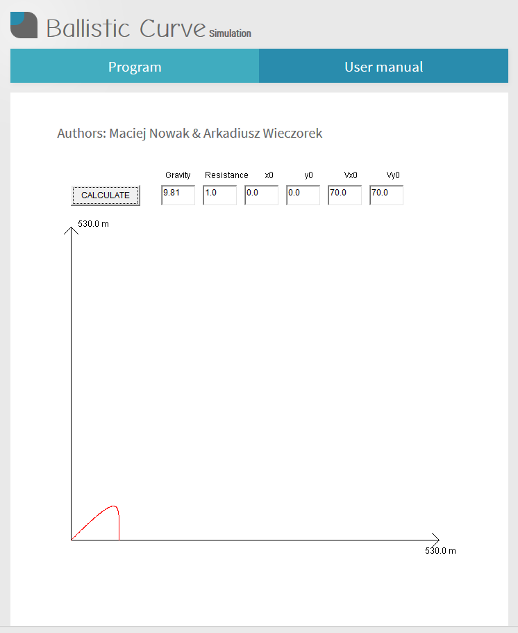
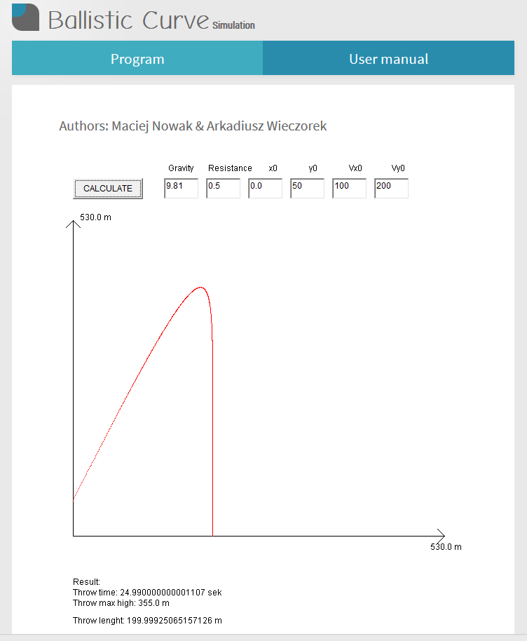

# PCS-Ballistic-Curve
Ballistic curve simulation. Created at the University as the project within Physic in Computer Science classes in 2013. The purpose of this project was to learn some physical formulas and their simulations. The project was required in Java applet.

## App
As the requirement of the classes this app was created as Java aplet with the custom HTML website. App allows to generate simulation of the ballistic curve and get to know how it works in physic theory.

### What is ballistic curve?
The oblique projection with regard to air resistance, otherwise known as the ballistic curve, is an asymmetrical curve on which the material point in space moves. Thrown out, or fired at a certain angle from the surface of the Earth.
  
If air resistance is omit in this projection, a symmetrical parabola is the result. In practice, this projection could be the trajectory of the projectile from the point of departure from the barrel to the point of fall. 

### How it works?
The program should contain values ​​of gravitational variables (m/s^2), resistance coefficient, start coordinates x0 and y0 and accelerations for vectors (m/s). After entering the selected values, press the **CALCULATE** button. A graph will be drawn, which represents a ballistic curve - corresponding to the aforementioned, exemplary trajectory of the projectile.
  
The results of the experiment will be presented below the chart. The time of the throw given in seconds, the maximum height that the material point reaches during the throw in meters, and the distance traveled in meters.

### Screenshots
Screenshots of simulation example.

 

### Variables
Gravity - default gravity (m/s^2)  
Resistance - the density coefficient of the environment  
x0 - starting coordinate X  
y0 - starting coordinate Y  
Vx0 - speed for the vector X (m/s)  
Vy0 - speed for the vector Y (m/s)  

